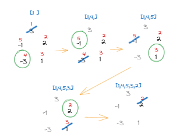

### 풍선 터뜨리기 2346
[링크](https://www.acmicpc.net/problem/2346)


문제 

```
1번부터 N번까지 N개의 풍선이 원형으로 놓여 있고. i번 풍선의 오른쪽에는 i+1번 풍선이 있고, 왼쪽에는 i-1번 풍선이 있다. 단, 1번 풍선의 왼쪽에 N번 풍선이 있고, N번 풍선의 오른쪽에 1번 풍선이 있다. 각 풍선 안에는 종이가 하나 들어있고, 종이에는 -N보다 크거나 같고, N보다 작거나 같은 정수가 하나 적혀있다. 이 풍선들을 다음과 같은 규칙으로 터뜨린다.

우선, 제일 처음에는 1번 풍선을 터뜨린다. 다음에는 풍선 안에 있는 종이를 꺼내어 그 종이에 적혀있는 값만큼 이동하여 다음 풍선을 터뜨린다. 양수가 적혀 있을 경우에는 오른쪽으로, 음수가 적혀 있을 때는 왼쪽으로 이동한다. 이동할 때에는 이미 터진 풍선은 빼고 이동한다.

예를 들어 다섯 개의 풍선 안에 차례로 3, 2, 1, -3, -1이 적혀 있었다고 하자. 이 경우 3이 적혀 있는 1번 풍선, -3이 적혀 있는 4번 풍선, -1이 적혀 있는 5번 풍선, 1이 적혀 있는 3번 풍선, 2가 적혀 있는 2번 풍선의 순서대로 터지게 된다.
```

입력

```
5
3 2 1 -3 -1
```

출력

```
1 4 5 3 2
```


solution



```python

n = int(input())  # 풍선의 개수
a = list(map(int, input().split()))  # 풍선의 이동 값 리스트
indices = list(range(1, n + 1))  # 풍선의 원본 인덱스 (1-based)
result = []  # 결과를 저장할 리스트
idx = 0  # 현재 인덱스

while a:
    move = a[idx]  # 현재 풍선의 이동 값
    result.append(indices.pop(idx))  # 원본 인덱스를 결과에 추가
    a.pop(idx)  # 현재 풍선을 제거

    if not a:  # 리스트가 비었으면 종료
        break

    # 다음 인덱스 계산
    if move > 0:
        idx = (idx + move - 1) % len(a)  # 오른쪽으로 이동
    else:
        idx = (idx + move) % len(a)  # 왼쪽으로 이동

result = ' '.join(map(str, result))
print(result)

```